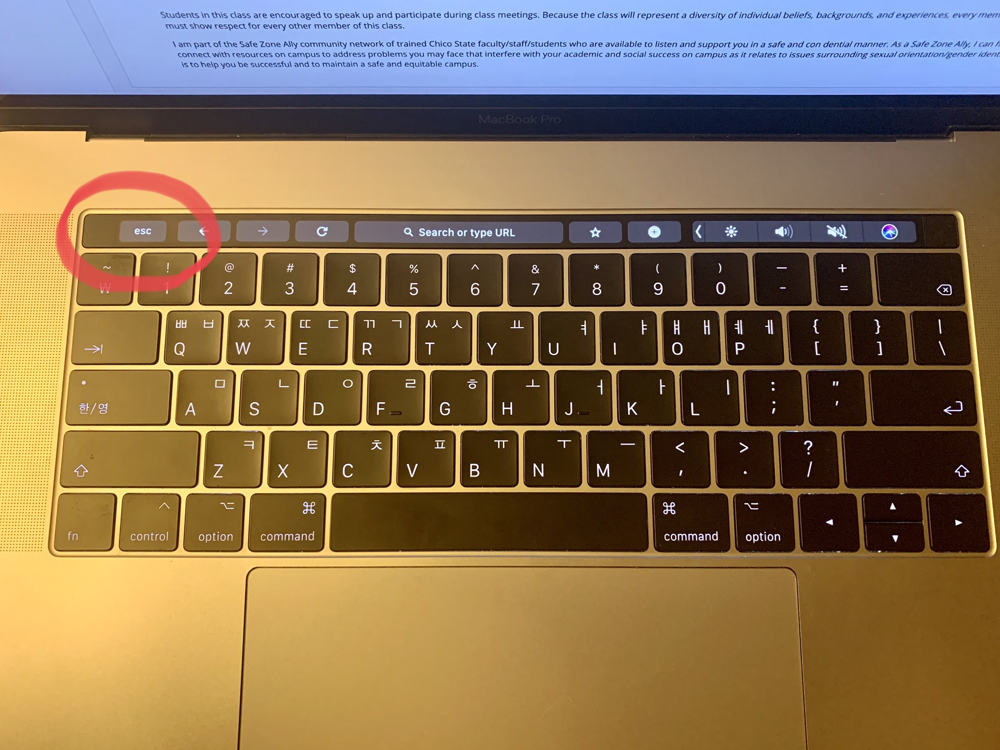

# Unsatisfying ESC Key

### Changsoo Jung
### 02/22/2020

I would like to talk about an unsatisfying ESC key of Macbook, which is uncomfortable to use. Since I know the defect of this product, it will be a good chance to tell a problem of the product and effects of the design.
  
  This is a keyboard of Apple's Macbook. As you can see, the top row above the number buttons is a touch bar. Normal buttons work with pressing, but this touch bar works with touching. Both functions in the same way, but there is a huge difference with a __feedback__. Usually, users can know whether the buttons were pressed or not even if they don't see the button since they can feel it. However, the touch bar is dependent on the user’s sight since users have to notice whether buttons were pressed by looking at a color change of the button when they are pressed. This design exceeds user's __error tolerance__ because most users don't see their keyboards when they are typing, especially for frequently used buttons like ESC. Users need to see the touch bar to make sure that they are using the right button when they are touching. It might not seem to be a big deal, but it can make an additional step to use the product, which is not __efficient__ and will decrease the user's __satisfaction__.

The touch bar shows well how Apple worked hard to show their new technology. When making this product, they seem to concern __object's affordance__ of users through the button alignment. However, they overlooked the most important thing; __feedback__ for the user's __satisfaction__. Since most users weren’t satisfied with the touch buttons especially the ESC key, Apple recovered the ESC key with a physical button for their new product.
  
  To get a better user experience, figuring out who customers are and what consumer’s tasks are a great idea. Apple's laptop is used by a lot of developers since their product allows them to develop programs that are available on their products. When coding programs, developers need to use Terminals and they need to press the ESC key frequently. Having an uncomfortable ESC key can give low usability to users. In many __senarios__, it will be a good method to ask about __who the users are__ and __what their tasks are__. In my guess, the new version of Macbook is a result of reflections of user experiences.

* Past Mackbook Pro Keyboard

* New Macbook Pro Keyboard

