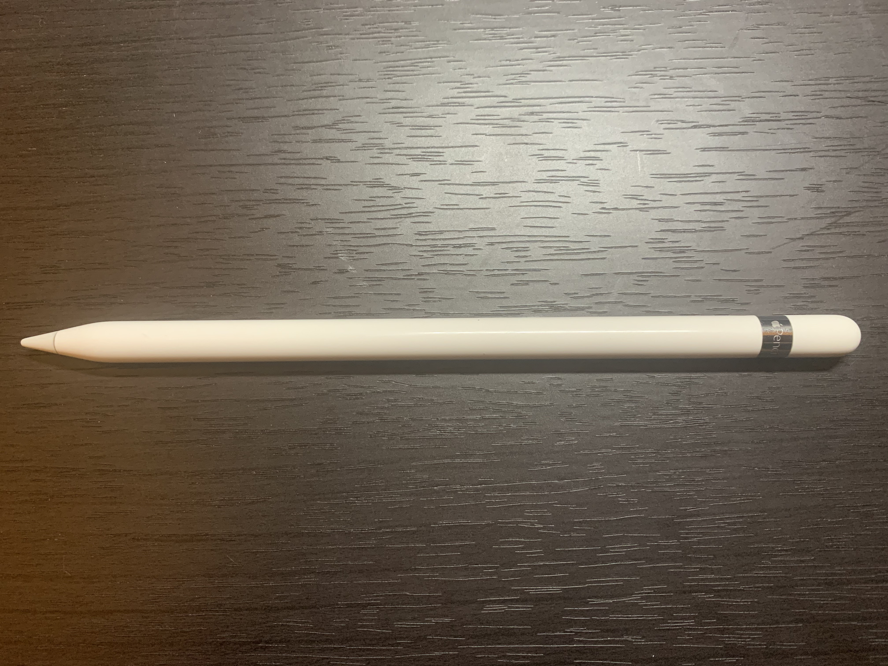
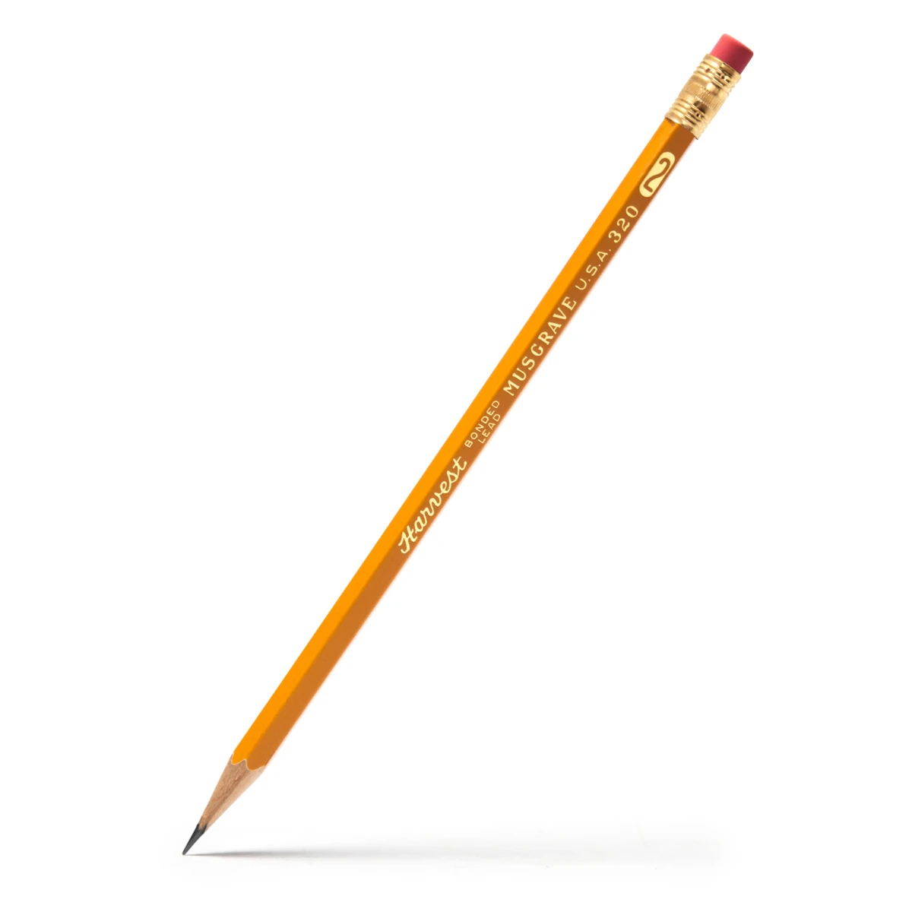

# Apple Pencil

### Changsoo Jung
### 04/06/2020

I would like to talk about Apple pencil since I used it for a year and I can describe it well as a consumer. I used it for note-taking, studying and drawing, so I would like to explain the usability of the Apple Pencil.

As you can see, an Apple Pencil is similar to a pencil that we usually think of. The bottom of the Apple Pencil is sharp and has a slightly different color, so we can think of the bottom part as a pencil’s lead. Also, the top of the Apple Pencil is covered by some steel, which resembled a usual pencil’s steel part covering a small eraser. These two parts show well that the Apple Pencil is a product corresponding to a pencil. As a different word, Apple adopts __object’s affordance__ to show that the Apple Pencil will replace a pencil’s function on an iPad. Through __object’s affordance__, customers can use the Apple pencil without any instruction.

Apple Pencil works great, but it misses one of the usabilities such as __satisfaction__. We always hold a pencil while we are using the pencil. Sometimes, we put the pencil on a desk or book, so our hands can take a rest for a moment. A normal pencil doesn’t move when we put it on a flat desk since the side of the pencil is composed of an octagon. However, the Apple Pencil’s side is composed of a round shape, so it can move to anywhere without controls. The Apple Pencil can distract concentration since we need to check the Apple Pencil’s movements to make sure it doesn’t roll and fall down when we put it on a desk. This means it can result in a low __satisfaction__ of a customer. Therefore, tracking customer’s habits can be a great idea to increase usability.

* Apple Pencil

* Pencil

