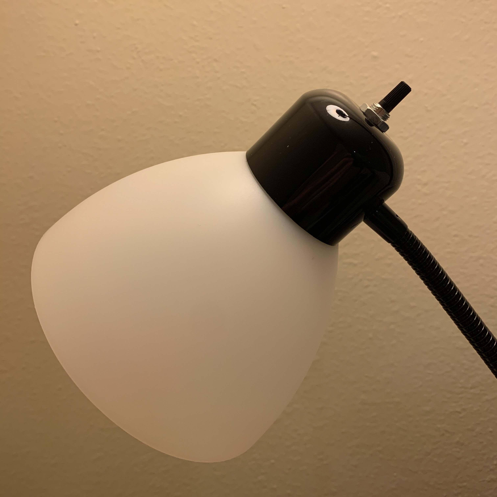
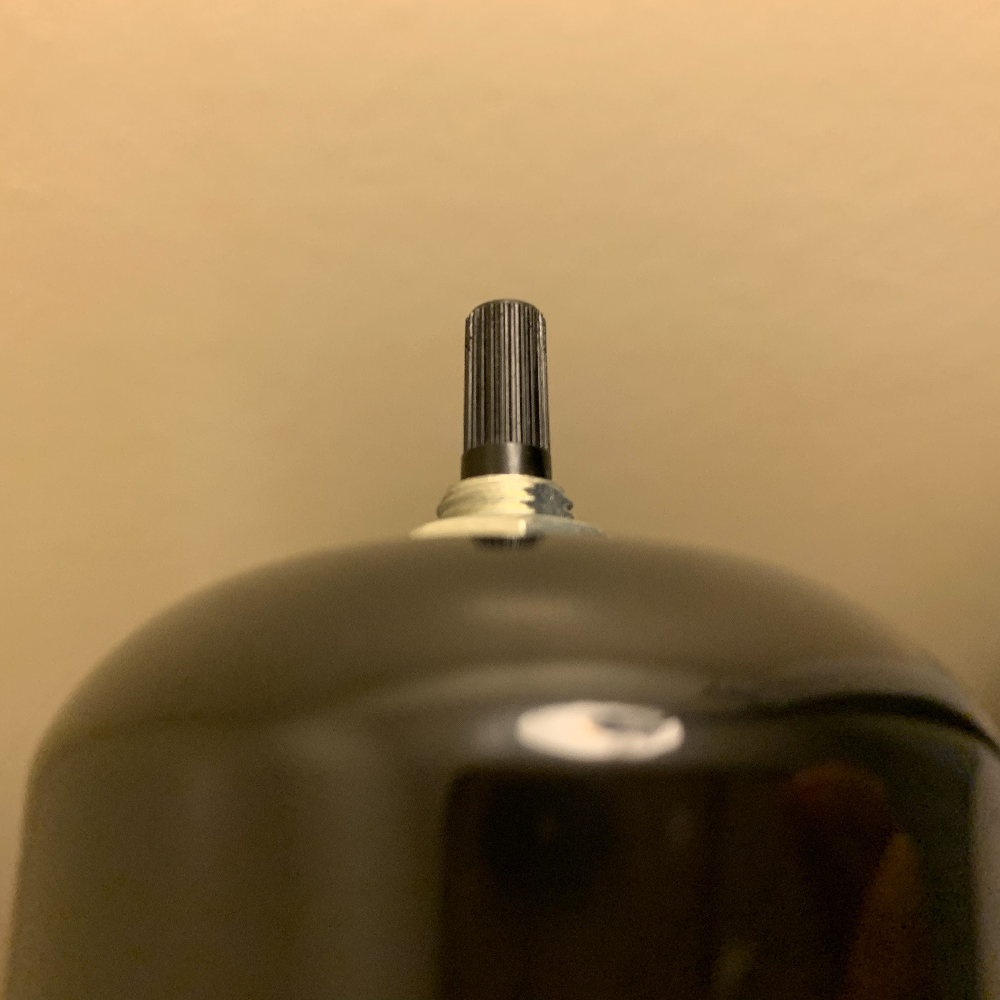
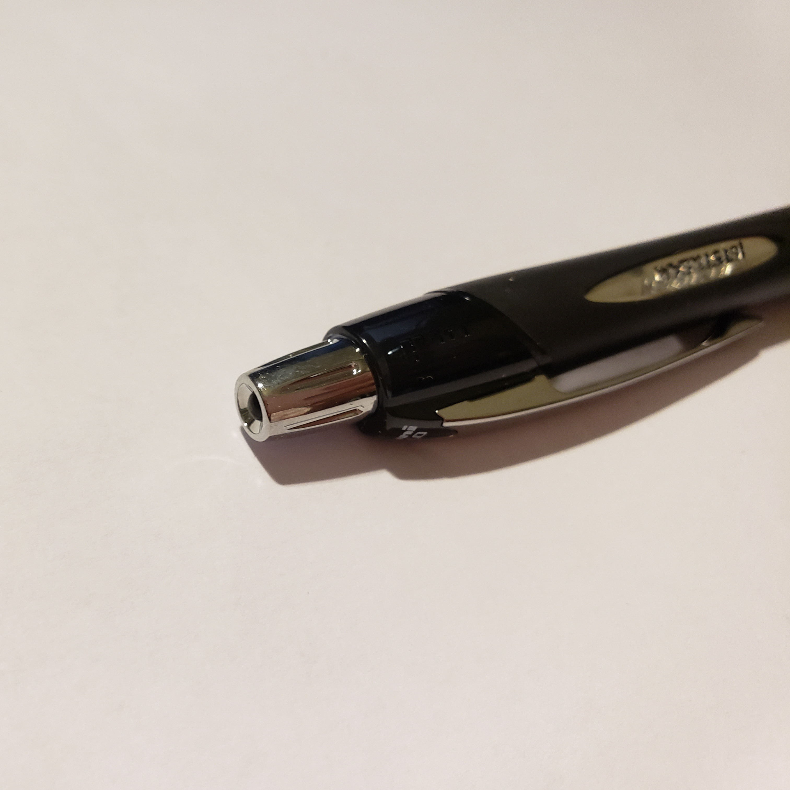
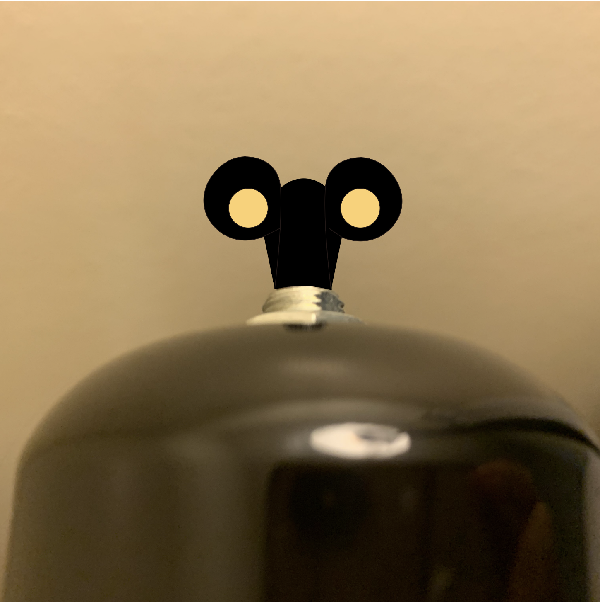

# Lamp key

### Changsoo Jung
### 04/05/2020

In our life, we can meet many kinds of lamp with different designs. Due to a variety of designs, there are a lot of patterns to operate them. I’m currently using a lamp, which works like a clockwork toy. If I want to turn on the light, I need to wind up a key located at the back of the lamp. 

* Lamp and close up version of the lamp

As you can see the key, it has some dents. If you see the lamp for the first time, you can realize that the light will turn on if you do something to the key. However, the important thing is that the key looks like it can work like a button or a clockwork key, which can confuse the first time user. Therefore, we can say that it’s object affordance isn’t clear. Fortunately, the lamp doesn’t have to consider error tolerant since it is memorable how to use it easily. 

* Similarity with pen's button

The name of the pen is Jetstream. It operates with a button located on top of the pen. The button looks similar to the key of the lamp even though they operate differently. For this reason, the lamp can improve its design if the lamp requires winding up to turn on the light. 

Let’s imagine a scenario with a persona.

James Bond is a student who likes mathematics. He likes to solve math problems since it gives big achievements to him. He used to study mathematics for 2 hours every day. He has strong self-reliance and always dreams about living alone.

He applied to a University to study mathematics and got admitted. As his dream, he decided to move out from his parent’s house. After leasing an apartment, James purchased some furniture including two lamps. He plans to start to assemble the lamps as soon as they arrive.

In James’ case, he will turn on the lamp after assembling them. However, he doesn’t know how to turn it on. He may try to press the key of the lamp. After the failure, he will wind up the key. Then, he will realize how to use it. 

* Expected design of the lamp wtih a clockwork key

If it takes a similarity of the clockwork key as in some clockwork toys, James will know how to use the lamp directly. The picture is the lamp which adopted the clockwork key. Most people have some experience playing with clockwork toys as kids. Therefore, the clockwork key can clearly tell first time users how to use it and no one will be confused about it. Through adopting the clockwork key, we can increase user’s satisfaction.
